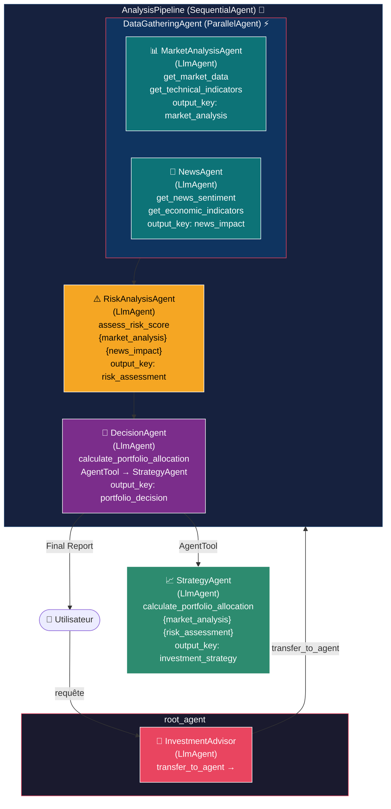
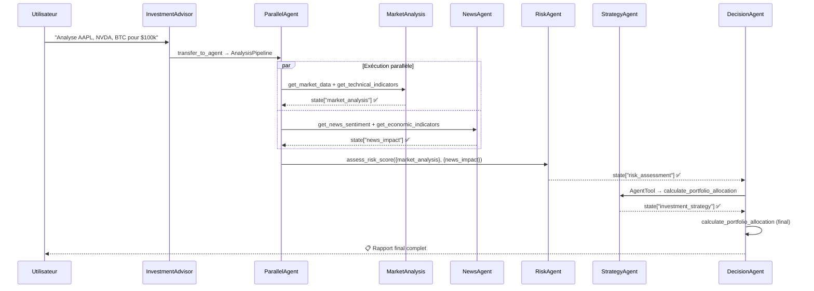

# 📈 Plateforme d'Investissement Automatisée — ADK Multi-Agents

> Système multi-agents Google ADK pour l'analyse financière et l'allocation de portefeuille automatisée.

---

## 🎯 Description du projet

Ce projet implémente une **plateforme d'investissement automatisée** utilisant le framework Google ADK. Elle coordonne **5 agents spécialisés** pour analyser les marchés financiers et produire des recommandations d'allocation de portefeuille complètes et structurées.

Le système analyse simultanément les données de marché et les actualités financières, évalue les risques, construit une stratégie court/long terme, puis synthétise une décision finale d'investissement avec des niveaux d'entrée, des stops et une allocation précise.

---

## 🏗️ Architecture Multi-Agents



### Flux de données (State partagé)



---

## ✅ Contraintes techniques couvertes

| # | Contrainte | Implémentation |
|---|------------|----------------|
| 1 | **≥ 3 LlmAgents** | 5 agents : InvestmentAdvisor, MarketAnalysisAgent, NewsAgent, RiskAnalysisAgent, StrategyAgent, DecisionAgent |
| 2 | **≥ 3 tools custom** | 6 outils : `get_market_data`, `get_technical_indicators`, `get_news_sentiment`, `get_economic_indicators`, `calculate_portfolio_allocation`, `assess_risk_score` |
| 3 | **≥ 2 Workflow Agents** | `SequentialAgent` (AnalysisPipeline) + `ParallelAgent` (DataGatheringAgent) |
| 4 | **State partagé** | `output_key` sur chaque agent + templates `{market_analysis}`, `{news_impact}`, `{risk_assessment}` dans les instructions |
| 5 | **2 mécanismes de délégation** | `transfer_to_agent` (InvestmentAdvisor → AnalysisPipeline) + `AgentTool` (DecisionAgent → StrategyAgent) |
| 6 | **≥ 2 callbacks** | `before_agent_callback` (logging + compteur) + `after_model_callback` (audit trail) |
| 7 | **Runner programmatique** | `main.py` avec `Runner` + `InMemorySessionService` |
| 8 | **Démo fonctionnelle** | Compatible `adk web` + `adk run investment_agent` |

---

## 📁 Structure du projet

```
investment_platform/
├── investment_agent/
│   ├── __init__.py              # Package entry point
│   ├── agent.py                 # Définition de tous les agents (root_agent)
│   ├── .env                     # Configuration modèle (NE PAS COMMIT)
│   └── tools/
│       ├── __init__.py
│       ├── market_tools.py      # get_market_data, get_technical_indicators
│       ├── news_tools.py        # get_news_sentiment, get_economic_indicators
│       └── portfolio_tools.py   # calculate_portfolio_allocation, assess_risk_score
├── tests/
│   └── investment_scenarios.test.json
├── main.py                      # Runner programmatique
├── .gitignore
└── README.md
```

---

## 🚀 Installation et lancement

### Prérequis

- Python 3.10+
- [Ollama](https://ollama.com) installé et lancé
- Git

### 1. Cloner et configurer

```bash
git clone <votre-repo>
cd investment_platform

# Créer l'environnement virtuel
python -m venv .venv

# Activer (Mac/Linux)
source .venv/bin/activate
# Activer (Windows CMD)
.venv\Scripts\activate.bat
```

### 2. Installer les dépendances

```bash
pip install google-adk
```

### 3. Télécharger un modèle Ollama

```bash
# Recommandé pour laptops standards
ollama run llama3.2

# Ou pour machines avec plus de RAM (meilleur en français)
ollama run mistral

# Ou pour machines légères
ollama run gemma2:2b
```

### 4. Configurer le modèle

Éditer `investment_agent/.env` :

```bash
ADK_MODEL_PROVIDER=ollama
ADK_MODEL_NAME=ollama/llama3.2   # adapter selon votre modèle
```

### 5. Lancer

```bash
# Interface web (recommandé pour la démo)
adk web

# Terminal interactif
adk run investment_agent

# Script Python direct
python main.py

# Script avec une requête spécifique
python main.py --query "Analyse TSLA et ETH pour $50,000"

# Lancer tous les scénarios de démo
python main.py --demo
```

---

## 💬 Exemples de requêtes

### Analyse complète d'un portefeuille

```
Analyse AAPL, NVDA et BTC pour un portefeuille de $100,000.
Donne-moi une recommandation complète avec allocation et niveaux d'entrée.
```

### Analyse court terme crypto

```
Analyse ETH et SOL pour du trading court terme avec $20,000.
Quels sont les niveaux d'entrée et les stops ?
```

### Focus risque macro

```
Le marché est-il risqué en ce moment ?
Analyse la situation macro et dis-moi si je dois réduire mon exposition.
```

### Stratégie long terme actions tech

```
Quelles actions tech devrais-je acheter et conserver 2 ans ?
J'ai $75,000 à investir avec un profil modéré.
```

### Question simple (sans pipeline)

```
Qu'est-ce que le RSI et comment l'interpréter ?
```

---

## 🛠️ Description des outils (Tools)

| Outil | Module | Description |
|-------|--------|-------------|
| `get_market_data(symbol)` | `market_tools` | Prix, volume, variation 24h, capitalisation, range 52 semaines |
| `get_technical_indicators(symbol)` | `market_tools` | RSI, MACD, ADX, moyennes mobiles MA20/50/200, Bandes de Bollinger |
| `get_news_sentiment(topic)` | `news_tools` | Analyse de sentiment des actualités, score -1→1, impact marché |
| `get_economic_indicators()` | `news_tools` | Inflation, taux Fed, VIX, PIB, taux 10 ans, régime de marché |
| `calculate_portfolio_allocation(risk, strategy, capital)` | `portfolio_tools` | Allocation optimale par classe d'actifs selon le profil risque |
| `assess_risk_score(volatility, sentiment, num_assets)` | `portfolio_tools` | Score de risque composite 0–100 avec recommandations de mitigation |

---

## 🔁 Callbacks

### `before_agent_callback`
- Déclenché **avant** chaque agent
- Affiche un banner de démarrage dans la console
- Incrémente un compteur `agents_executed` dans le state de session

### `after_model_callback`
- Déclenché **après** chaque réponse du modèle LLM
- Extrait un aperçu du texte et l'ajoute à un `audit_trail` dans le state
- Utile pour le débogage et l'auditabilité des décisions

---

## 📊 Exemple de sortie

```
══════════════════════════════════════════
📊  FINAL INVESTMENT DECISION REPORT
══════════════════════════════════════════

## EXECUTIVE SUMMARY
- Market Outlook: Mixed technicals with bullish momentum on tech sector
- Risk Level: MODERATE (score 42/100) — VIX below 20, macro stable
- Recommended Action: INVEST

## PORTFOLIO ALLOCATION ($100,000)
| Asset Class  |  % | Amount USD  |
|--------------|----| ------------|
| Stocks       | 55 | $55,000     |
| Bonds        | 25 | $25,000     |
| Cash         | 10 | $10,000     |
| Alternatives | 10 | $10,000     |

## TOP INVESTMENT PICKS
1. NVDA — 15% position — Entry: $875 — Target: $1,050 — Stop: $810
   Rationale: RSI neutral, MACD bullish, AI sector momentum strong.
2. AAPL — 12% position — Entry: $189 — Target: $215 — Stop: $175
   Rationale: Golden cross detected, institutional accumulation confirmed.
3. BTC — 8% position — Entry: $67,500 — Target: $82,000 — Stop: $62,000
   Rationale: Positive on-chain sentiment, oversold on RSI.

## RISK MANAGEMENT RULES
- Max loss per position: 8%
- Portfolio stop-loss trigger: 15% drawdown
- Rebalancing: QUARTERLY

## IMMEDIATE ACTION ITEMS (Next 48h)
1. Open NVDA position at market open
2. Set limit orders for AAPL at $189
3. Allocate 25% to bonds via ETF (AGG)
```

---

## 🔍 Notes de développement

- Toutes les données de marché sont **simulées** (pas d'API externe requise)
- Pour connecter des données réelles, remplacer les fonctions dans `tools/` par des appels à Yahoo Finance, Alpha Vantage, ou CoinGecko
- Le `random.seed(42)` dans `market_tools.py` peut être retiré pour des données dynamiques à chaque appel
- Les modèles plus grands (Mistral 7B, Llama 3.1 8B) produisent des rapports plus détaillés et mieux structurés
