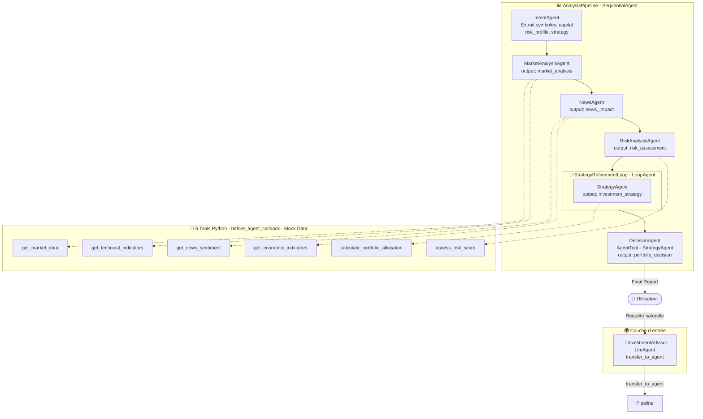

# 📈 Plateforme d'Investissement Automatisée — ADK Multi-Agents

> Système multi-agents Google ADK pour l'analyse financière et l'allocation de portefeuille automatisée avec Gemini 2.5 Flash Lite — déployé sur Google Cloud Run avec un frontend Next.js.

**Version actuelle** : v3.0 (Architecture ADK complète + Déploiement Cloud + Frontend Web)  
**Modèle LLM (production)** : `gemini-2.5-flash-lite`  
**Framework** : Google ADK (Agentic Development Kit)  
**API** : https://investment-agent-449502745670.europe-west1.run.app  
**Frontend** : Déployé sur Vercel.   
**réalisée par : HICHAM GARRAD**

## **🌐 Lien de la platform** : https://investment-platform-mu.vercel.app/

> ⚠️ **Note importante** : Les données financières utilisées dans ce projet sont des **données simulées (mock data)** générées aléatoirement à des fins de démonstration. Les prix, indicateurs techniques, sentiments de news et données macro sont tous synthétiques. En perspective, l'objectif est de remplacer ces mocks par de **vraies APIs financières** (Yahoo Finance, Alpha Vantage, NewsAPI, FRED, etc.).

---

## 📋 Table des matières

1. [Description du projet](#description-du-projet)
2. [Données simulées et perspectives](#données-simulées-et-perspectives)
3. [Architecture multi-agents](#architecture-multi-agents)
4. [Comparaison des modèles LLM](#comparaison-des-modèles-llm)
5. [Déploiement Cloud](#déploiement-cloud)
6. [Frontend Next.js](#frontend-nextjs)
7. [Étapes de réalisation et défis](#étapes-de-réalisation-et-défis)
8. [Installation locale](#installation-locale)
9. [Lancement](#lancement)
10. [Exemples de requêtes](#exemples-de-requêtes)
11. [Structure du projet](#structure-du-projet)
12. [Contraintes techniques satisfaites](#contraintes-techniques-satisfaites)
13. [Perspectives](#perspectives)

---

## 🎯 Description du projet {#description-du-projet}

### Objectif principal

Implémentation d'une **plateforme d'investissement automatisée** utilisant le framework Google ADK pour orchestrer **6 agents LLM spécialisés** qui analysent les marchés financiers de manière collaborative et produisent des recommandations d'allocation de portefeuille complètes, structurées et justifiées.

La plateforme est entièrement déployée sur **Google Cloud Run** et consommable via une **interface web Next.js** avec chatbot IA intégré.

### Fonctionnalités clés

- ✅ **Extraction d'intention dynamique** : IntentAgent extrait symboles, capital, profil de risque et stratégie depuis le message utilisateur
- ✅ **Analyse multi-dimensionnelle** : Marché, actualités, risques, stratégie
- ✅ **Agents spécialisés** : Analyste marché, analyste news, responsable risque, gestionnaire portefeuille, CIO
- ✅ **Orchestration complexe** : Séquençage, boucles, délégations (transfer_to_agent + AgentTool)
- ✅ **Pré-fetch de données** : Tools appelés en Python pur via callbacks (zéro hallucination LLM)
- ✅ **API REST** : FastAPI wrapper exposant le pipeline comme API REST
- ✅ **CI/CD automatique** : GitHub Actions → Cloud Run à chaque push
- ✅ **Interface web** : Dashboard, chatbot, historique des analyses

### Cas d'usage

```
Utilisateur : "Stratégie MODERATE sur $50,000 avec GOOGL et AMZN"
  ↓
IntentAgent  : extrait { symboles: [GOOGL, AMZN], capital: 50000, profil: MODERATE }
  ↓
MarketAgent  : analyse prix, RSI, MACD pour GOOGL et AMZN (données simulées)
  ↓
NewsAgent    : sentiment news + indicateurs macro (données simulées)
  ↓
RiskAgent    : score de risque + recommandations
  ↓
StrategyLoop : allocation optimale sur $50,000
  ↓
DecisionAgent: rapport final avec top 3 picks, stops, action items (48h)
```

---

## 📊 Données simulées et perspectives {#données-simulées-et-perspectives}

### Situation actuelle — Mock Data

Toutes les données financières sont **simulées en Python** avec `random` pour des raisons de démonstration et d'indépendance vis-à-vis des APIs externes.

| Tool                               | Données simulées              | Comportement                                        |
| ---------------------------------- | ----------------------------- | --------------------------------------------------- |
| `get_market_data()`                | Prix, volume, market cap      | Prix de base ±3% aléatoire                          |
| `get_technical_indicators()`       | RSI, MACD, ADX, MA, Bollinger | Valeurs aléatoires dans plages réalistes            |
| `get_news_sentiment()`             | Headlines, score sentiment    | Templates avec 40% positif, 30% négatif, 30% neutre |
| `get_economic_indicators()`        | VIX, inflation, GDP, Fed Rate | Ranges réalistes simulés                            |
| `calculate_portfolio_allocation()` | Allocation stocks/bonds/cash  | Table de lookup fixe par profil                     |
| `assess_risk_score()`              | Score 0-100, recommandations  | Formule mathématique déterministe                   |

**Exemple de mock data** :

```python
# market_tools.py — prix de base hardcodés
_BASE_PRICES = {
    "AAPL": 189.50, "NVDA": 875.30, "BTC": 67500.0, ...
}
# Variation aléatoire ±3% à chaque appel
price = round(base * random.uniform(0.97, 1.03), 2)
```

### Perspectives — Vraies APIs financières

L'architecture des tools est conçue pour être facilement remplaçable. Voici les APIs qui seront intégrées :

| Tool actuel (mock)           | API réelle prévue          | Données                                          |
| ---------------------------- | -------------------------- | ------------------------------------------------ |
| `get_market_data()`          | Yahoo Finance (`yfinance`) | Prix temps réel, volume, market cap              |
| `get_technical_indicators()` | Alpha Vantage, Polygon.io  | RSI, MACD, Bollinger calculés sur vraies données |
| `get_news_sentiment()`       | NewsAPI, Refinitiv         | Vraies headlines + NLP sentiment                 |
| `get_economic_indicators()`  | FRED API, World Bank       | Inflation, GDP, taux réels                       |

**Migration prévue** — aucun changement dans `agent.py` requis, seulement dans `tools/` :

```python
# Avant (mock)
def get_market_data(symbol):
    return {"price": random.uniform(100, 500), ...}

# Après (vraie API)
def get_market_data(symbol):
    import yfinance as yf
    ticker = yf.Ticker(symbol)
    return ticker.info
```

---

## 🏗️ Architecture multi-agents {#architecture-multi-agents}

### Schéma global (v3 — Actuelle)



### Amélioration clé : IntentAgent

Le `IntentAgent` est le **premier agent du pipeline**. Il utilise le LLM pour extraire dynamiquement tous les paramètres depuis le message utilisateur :

```json
// Input: "Stratégie MODERATE sur $50,000 avec GOOGL et AMZN"
// Output (intent_data):
{
  "requested_symbols": ["GOOGL", "AMZN"],
  "user_capital": 50000,
  "risk_profile": "MODERATE",
  "investment_strategy_type": "BALANCED"
}
```

Tous les agents suivants lisent ces valeurs dynamiquement depuis le state — **aucune valeur hardcodée**.

---

## 🤖 Comparaison des modèles LLM {#comparaison-des-modèles-llm}

Un des objectifs du projet était de tester la **même architecture finale** avec différents modèles pour illustrer l'importance du choix du LLM dans un système multi-agents complexe.

### Méthodologie de test

La même architecture (6 agents, 3 callbacks, SequentialAgent + LoopAgent + AgentTool) a été testée avec :

- Des modèles locaux via **Ollama** (zéro coût, confidentialité)
- L'API cloud **Google Gemini** (production)

### Résultats — Erreurs réelles observées

#### ❌ llama3.2:3b (Ollama local)

```
ValueError: Tool 'answer' not found.
Available tools: transfer_to_agent
```

Le modèle hallucine un tool `answer` pour répondre à un simple "hi" au lieu de répondre en texte direct. Il ne comprend pas qu'il peut répondre sans appeler de tool.

```
ValueError: Tool 'FinalInvestmentDecisionReport' not found.
Available tools: StrategyAgent
```

Quand le `DecisionAgent` doit produire le rapport final, le modèle invente un tool du nom du rapport au lieu d'écrire le texte directement.

**Autres problèmes** :

- Mac Air 8 GB RAM : gel système lors du chargement du modèle
- Temps de réponse : 30-60s par agent (vs 3-5s avec Gemini)
- JSON mal formé par IntentAgent (backticks, texte parasite)

#### ⚠️ mistral:7b (Ollama local)

```
ValueError: Tool 'FinalInvestmentDecisionReport' not found.
Available tools: StrategyAgent
```

Même hallucination de noms de tools. Mistral 7B ne distingue pas clairement "écrire un rapport" de "appeler un tool nommé rapport".

**Autres problèmes** :

- Lent sur Mac 8 GB (swap intensif)
- Nécessite des instructions très courtes et directives
- JSON de IntentAgent souvent entouré de texte parasite

#### ✅ gemini-2.5-flash-lite (API Google)

- Zéro hallucination de noms de tools
- JSON propre depuis IntentAgent (parfois avec backticks → résolu par `_clean_json()`)
- Pipeline complet en 30-60 secondes
- Rapports structurés et cohérents
- Gestion correcte de `transfer_to_agent` et `AgentTool`

### Tableau comparatif complet

| Modèle                  | Type         | RAM requise | Function Calling | Hallucinations tools       | Qualité rapports | Verdict       |
| ----------------------- | ------------ | ----------- | ---------------- | -------------------------- | ---------------- | ------------- |
| `gemma2:2b`             | Local Ollama | 4 GB        | ❌ Très faible   | 🔴 Massives                | ⭐               | ❌ Rejeté     |
| `llama3.2:3b`           | Local Ollama | 4 GB        | ❌ Faible        | 🔴 `answer`, noms de tools | ⭐               | ❌ Rejeté     |
| `mistral:7b`            | Local Ollama | 8 GB        | ⚠️ Moyen         | 🟡 Noms de tools           | ⭐⭐             | ⚠️ Instable   |
| `llama2:13b`            | Local Ollama | 16 GB       | ✅ Bon           | 🟡 Modérées                | ⭐⭐⭐           | ⚠️ Lent       |
| `gemini-2.5-flash-lite` | Cloud Google | 0 (API)     | ✅✅ Excellent   | 🟢 Quasi-nulles            | ⭐⭐⭐⭐⭐       | ✅ **Retenu** |

### Conclusion

> **Les modèles locaux < 7B sont insuffisants pour les architectures multi-agents complexes.** Ils ne maîtrisent pas le function calling et hallucinent systématiquement les noms de tools, rendant le pipeline instable. Les APIs cloud (Gemini, GPT-4o) restent indispensables pour la production, offrant une qualité et une fiabilité incomparables pour ce type d'orchestration.

Les erreurs observées avec les petits modèles constituent en elles-mêmes une démonstration pédagogique des limitations actuelles des LLMs locaux pour les systèmes multi-agents.

---

## ☁️ Déploiement Cloud {#déploiement-cloud}

### Infrastructure

```
GitHub (push main)
      ↓
GitHub Actions (CI/CD)
      ├── Tests Python (test_tools)
      ├── Build Docker image
      ├── Push → Artifact Registry (europe-west1)
      └── Deploy → Cloud Run
                  ↓
         investment-agent-449502745670.europe-west1.run.app
                  ↑
         GOOGLE_API_KEY (Secret Manager)
```

### Endpoints API disponibles

| Endpoint     | Méthode | Description                        |
| ------------ | ------- | ---------------------------------- |
| `/health`    | GET     | Health check Cloud Run             |
| `/analyze`   | POST    | Lancer le pipeline complet         |
| `/symbols`   | GET     | Liste des symboles reconnus        |
| `/scenarios` | GET     | Scénarios de test disponibles      |
| `/docs`      | GET     | Documentation Swagger auto-générée |

### Exemple d'appel API

```bash
curl -X POST https://investment-agent-449502745670.europe-west1.run.app/analyze \
  -H "Content-Type: application/json" \
  -d '{
    "query": "Stratégie MODERATE sur $50,000 avec GOOGL et AMZN",
    "user_id": "user_001"
  }'
```

### Réponse

```json
{
  "session_id": "uuid",
  "final_response": "Final Investment Decision Report...",
  "outputs": {
    "market_analysis": "...",
    "news_impact": "...",
    "risk_assessment": "...",
    "investment_strategy": "...",
    "portfolio_decision": "..."
  },
  "status": "success"
}
```

### Configuration CI/CD (GitHub Secrets requis)

| Secret                | Valeur                                |
| --------------------- | ------------------------------------- |
| `GCP_PROJECT_ID`      | `agents-project-489310`               |
| `WIF_PROVIDER`        | Workload Identity Federation provider |
| `WIF_SERVICE_ACCOUNT` | Service account GitHub Actions        |
| `GOOGLE_API_KEY`      | Clé Gemini (Secret Manager)           |
| `FRONTEND_URL`        | URL du frontend Vercel                |

### Défis de déploiement rencontrés

| Défi                           | Cause                                     | Solution                                                 |
| ------------------------------ | ----------------------------------------- | -------------------------------------------------------- |
| Clé API exposée sur GitHub     | `.env` commité par erreur                 | `git rm --cached`, nouvelle clé, Secret Manager          |
| `Session not found`            | ADK sync/async mismatch                   | Fonction `_call()` détectant sync vs async               |
| Symboles incorrects (AAPL/BTC) | LLM retourne JSON avec backticks markdown | Fonction `_clean_json()` nettoyant avant parse           |
| Cloud Run permissions 403      | SA compute sans droits storage            | Ajout `roles/storage.admin` et `roles/logging.logWriter` |
| Workload Identity condition    | Mauvais nom de repo GitHub                | Mise à jour `attribute-condition` avec bon nom           |

---

## 🌐 Frontend Next.js {#frontend-nextjs}

### Pages disponibles

| Page       | URL        | Description                             |
| ---------- | ---------- | --------------------------------------- |
| Dashboard  | `/`        | Aperçu marché, stats, analyses récentes |
| Analyser   | `/analyze` | Chatbot IA avec rapports par agent      |
| Historique | `/history` | Toutes les analyses passées             |

### Fonctionnalités

- 🌙 **Dark mode** par défaut (toggle clair/sombre)
- 💬 **Chatbot** avec suggestions de requêtes
- 📊 **Graphiques** sparkline par symbole (Recharts)
- 📋 **Rapports accordéon** par agent (Market, News, Risk, Strategy, Decision)
- 🔍 **Historique** avec recherche et détail complet
- ⚡ **Indicateur** de statut API en temps réel

### Stack technique

- **Framework** : Next.js 14 (App Router)
- **Styling** : Tailwind CSS + CSS Variables
- **Charts** : Recharts
- **Markdown** : react-markdown
- **Fonts** : Syne (display) + DM Mono + DM Sans
- **Deploy** : Vercel (CI/CD automatique via GitHub)

### Variables d'environnement frontend

```bash
# .env.local
NEXT_PUBLIC_API_URL=https://investment-agent-449502745670.europe-west1.run.app
```

---

## 🚀 Étapes de réalisation et défis {#étapes-de-réalisation-et-défis}

### 📍 Architecture v1 — Non stable (Modèles locaux)

| #   | Défi                   | Cause                                           | Impact               |
| --- | ---------------------- | ----------------------------------------------- | -------------------- |
| D1  | `Tool not found`       | Modèles 2B-3B hallucinent les noms d'agents     | Boucles infinies     |
| D2  | Appels tools en boucle | LLM local ne sait pas quand arrêter             | RAM saturée, timeout |
| D3  | Modèles trop limités   | 2B-3B paramètres insuffisants pour multi-agents | Zéro convergence     |

### 📍 Architecture v2 — Semi-stable

Suppression du `ParallelAgent` pour éviter les hallucinations de noms d'agents.

### 📍 Architecture v3 — Stable (Pré-fetch)

**Breakthrough** : Tools appelés en Python pur via `before_agent_callback`. Le LLM reçoit les données pré-chargées sans voir aucun nom de fonction.

### 📍 Architecture v4 — Cloud (Gemini)

Migration vers `gemini-2.5-flash-lite` → zéro hallucinations, rapports structurés.

### 📍 Architecture v5 — Production complète

- Ajout `IntentAgent` pour extraction dynamique des paramètres
- Wrapper FastAPI (`server.py`) exposant le pipeline comme API REST
- Déploiement Google Cloud Run avec CI/CD GitHub Actions
- Frontend Next.js avec chatbot et dashboard
- Secret Manager pour la gestion des clés API

---

## 💾 Installation locale {#installation-locale}

### Prérequis

- Python 3.10+
- Node.js 18+ (pour le frontend)
- Clé API Google Gemini ([AI Studio](https://aistudio.google.com/app/apikey))

### Backend (Agent ADK)

```bash
# 1. Cloner le repo
git clone https://github.com/GARRADHICHAM/TP-Projet-Multi-Agents-ADK.git
cd TP-Projet-Multi-Agents-ADK

# 2. Environnement virtuel
python3 -m venv .venv
source .venv/bin/activate

# 3. Installer les dépendances
pip install -r requirements.txt

# 4. Configurer la clé API (NE PAS committer ce fichier !)
echo "GOOGLE_API_KEY=votre_cle_ici" > investment_agent/.env

# 5. Lancer le serveur API localement
python server.py
# → http://localhost:8080
```

### Frontend Next.js

```bash
cd investment-platform
npm install
echo "NEXT_PUBLIC_API_URL=http://localhost:8080" > .env.local
npm run dev
# → http://localhost:3000
```

### Test avec modèles locaux (optionnel)

```bash
# Installer Ollama
brew install ollama
ollama pull llama3.2:3b   # léger mais limité
ollama pull mistral:7b    # meilleur mais lourd (8 GB RAM min)

# Changer le modèle dans agent.py
_MODEL = "ollama/llama3.2:3b"

# Lancer
python main.py
# ⚠️ Attendez-vous à des hallucinations de tools avec ces modèles
```

---

## 🚀 Lancement {#lancement}

### Via l'interface web

1. Ouvrir le frontend Vercel
2. Aller sur **Analyser**
3. Taper une requête ou cliquer sur une suggestion
4. Attendre 30-60 secondes le pipeline complet
5. Consulter les rapports de chaque agent

### Via l'API directement

```bash
curl -X POST https://investment-agent-449502745670.europe-west1.run.app/analyze \
  -H "Content-Type: application/json" \
  -d '{"query": "Analyse NVDA et BTC", "user_id": "test"}'
```

### Via main.py (local)

```bash
python main.py --query "Analyse NVDA pour $50,000 profil agressif"
```

### Via ADK Web

```bash
adk web investment_agent/
# → http://localhost:8000
```

---

## 🧪 Exemples de requêtes {#exemples-de-requêtes}

```
"Analyse NVDA et BTC pour moi"
"Stratégie MODERATE sur $50,000 avec GOOGL et AMZN"
"Donne-moi une stratégie aggressive sur la tech avec $100,000"
"Portfolio conservateur $500,000 avec VTI QQQ GLD, horizon 5 ans"
"Analyse BTC ETH SOL pour $10,000 profil agressif"
```

---

## 📁 Structure du projet {#structure-du-projet}

```
TP-Projet-Multi-Agents-ADK/
├── README.md
├── main.py                            ← Entry point local
├── server.py                          ← FastAPI wrapper (API REST)
├── Dockerfile                         ← Conteneurisation Cloud Run
├── requirements.txt
├── setup_gcp.sh                       ← Script configuration GCP
│
├── .github/
│   └── workflows/
│       └── deploy.yml                 ← CI/CD GitHub Actions
│
├── investment_agent/
│   ├── __init__.py
│   ├── agent.py                       ← 6 LlmAgents + 2 Workflow Agents
│   └── tools/                         ← Mock data (vraies APIs prévues)
│       ├── market_tools.py            ← Simule prix, RSI, MACD
│       ├── news_tools.py              ← Simule headlines, sentiment
│       └── portfolio_tools.py         ← Allocation + risk score
│
├── tests/
│   ├── test_pipeline.py
│   └── investment_scenarios.test.json
│
└── investment-platform/               ← Frontend Next.js
    ├── app/
    │   ├── page.tsx                   ← Dashboard
    │   ├── analyze/page.tsx           ← Chatbot IA
    │   └── history/page.tsx           ← Historique
    ├── components/Sidebar.tsx
    ├── lib/api.ts                     ← Client API
    └── package.json
```

---

## ✅ Contraintes techniques satisfaites {#contraintes-techniques-satisfaites}

| Contrainte                          | Détail                                                                                                                                    | Satisfait |
| ----------------------------------- | ----------------------------------------------------------------------------------------------------------------------------------------- | --------- |
| **C1 : ≥ 5 LlmAgents**              | IntentAgent, MarketAnalysisAgent, NewsAgent, RiskAnalysisAgent, StrategyAgent, DecisionAgent (6 au total)                                 | ✅        |
| **C2 : ≥ 6 tools custom**           | get_market_data, get_technical_indicators, get_news_sentiment, get_economic_indicators, calculate_portfolio_allocation, assess_risk_score | ✅        |
| **C3 : ≥ 2 Workflow Agents**        | SequentialAgent (AnalysisPipeline) + LoopAgent (StrategyRefinementLoop)                                                                   | ✅        |
| **C4 : State partagé & output_key** | Tous les agents ont `output_key` unique + templates `{variable}`                                                                          | ✅        |
| **C5 : 2 délégations**              | transfer_to_agent (InvestmentAdvisor→Pipeline) + AgentTool (DecisionAgent→StrategyAgent)                                                  | ✅        |
| **C6 : 3 callbacks**                | before_agent_callback, before_model_callback, after_model_callback                                                                        | ✅        |
| **C7 : Runner programmatique**      | InMemorySessionService + Runner + async                                                                                                   | ✅        |
| **C8 : Compatible adk web**         | root_agent exposé dans `__init__.py`                                                                                                      | ✅        |

---

## 🔭 Perspectives {#perspectives}

- [ ] Remplacer les mock data par de vraies APIs financières (Yahoo Finance, Alpha Vantage, NewsAPI, FRED)
- [ ] Ajouter l'authentification utilisateur sur le frontend
- [ ] Persistance de l'historique en base de données (Firestore)
- [ ] Notifications en temps réel via WebSockets
- [ ] Support multi-portefeuilles par utilisateur
- [ ] Backtesting sur données historiques réelles

---
