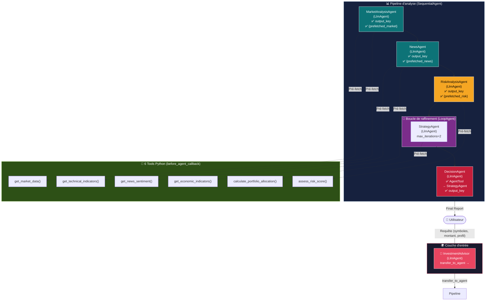

# 📈 Plateforme d'Investissement Automatisée — ADK Multi-Agents

> Système multi-agents Google ADK pour l'analyse financière et l'allocation de portefeuille automatisée avec LLMs modernes (Gemini 2.5 Flash Lite).

**Version actuelle** : v2.0 (Architecture ADK complète)  
**Modèle LLM** : `gemini-2.5-flash-lite`  
**Framework** : Google ADK (Agentic Development Kit)

---

## 📋 Table des matières

1. [Description du projet](#description-du-projet)
2. [Architecture multi-agents](#architecture-multi-agents)
3. [Étapes de réalisation et défis](#étapes-de-réalisation-et-défis)
4. [Installation](#installation)
5. [Lancement](#lancement)
6. [Exemples de requêtes](#exemples-de-requêtes)
7. [Structure du projet](#structure-du-projet)
8. [Contraintes techniques satisfaites](#contraintes-techniques-satisfaites)

---

## 🎯 Description du projet

### Objectif principal

Implémentation d'une **plateforme d'investissement automatisée** utilisant le framework Google ADK pour orchestrer **5 agents LLM spécialisés** qui analysent les marchés financiers de manière collaborative et produisent des recommandations d'allocation de portefeuille complètes, structurées et justifiées.

### Fonctionnalités clés

- ✅ **Analyse multi-dimensionnelle** : Marché, actualités, risques, stratégie
- ✅ **Agents spécialisés** : Chacun expert dans son domaine (analyste marché, analyste news, responsable risque, gestionnaire portefeuille, CIO)
- ✅ **Orchestration complexe** : Séquençage, boucles, délégations (transfer_to_agent + AgentTool)
- ✅ **Pré-fetch de données** : Tools appelés en Python pur via callbacks (zéro hallucination LLM)
- ✅ **Rapports structurés** : Format JSON, tableaux d'allocation, ratios de risque, plans d'action

### Cas d'usage

```
Utilisateur : "Analyse AAPL, NVDA et BTC pour 100 000$ en profil modéré"
  ↓
Plateforme :
  1. Récupère prix, tendances techniques (RSI, MACD)
  2. Analyse sentiment news et indicateurs macro
  3. Évalue score de risque et volatilité
  4. Calcule allocation optimale (stocks/bonds/cash)
  5. Produit rapport final avec top 3 picks, stops, action items
```

---

## 🏗️ Architecture multi-agents

### Schéma global



### Flux de données détaillé

```
┌─────────────────────────────────────────────────────────────┐
│ 1. USER REQUEST (main.py)                                   │
│    "Analyse AAPL, NVDA, BTC pour 100k$"                     │
└────────────────────┬────────────────────────────────────────┘
                     ↓
┌─────────────────────────────────────────────────────────────┐
│ 2. INVESTMENT ADVISOR (root_agent)                          │
│    • before_agent_callback : Sauvegarde user_message        │
│    • Exécution LLM : Détecte "investissement" → transfer    │
│    • after_model_callback : Log audit trail                 │
└────────────────────┬────────────────────────────────────────┘
                     ↓
┌─────────────────────────────────────────────────────────────┐
│ 3. ANALYSIS PIPELINE (SequentialAgent)                      │
│    └─ Exécute séquentiellement : M → N → R → LOOP → D      │
└────────────────────┬────────────────────────────────────────┘
                     ↓
    ┌────────────────┬────────────────┬────────────────┐
    ↓                ↓                ↓                ↓
┌─────────┐      ┌─────────┐      ┌─────────┐      ┌──────────┐
│ MARKET  │      │ NEWS    │      │ RISK    │      │ STRATEGY │
│ Agent   │      │ Agent   │      │ Agent   │      │ Loop     │
│         │      │         │      │         │      │ (max 2×) │
│ Before: │      │ Before: │      │ Before: │      │          │
│ • fetch │      │ • fetch │      │ • fetch │      │ Before:  │
│   market│      │   news  │      │ risk    │      │ • fetch  │
│ • fetch │      │ • fetch │      │   score │      │  alloc   │
│   tech  │      │   macro │      │         │      │          │
│         │      │         │      │         │      │          │
│ Output: │      │ Output: │      │ Output: │      │ Output:  │
│ {mkt}   │      │ {news}  │      │ {risk}  │      │ {strat}  │
└────┬────┘      └────┬────┘      └────┬────┘      └────┬─────┘
     │                │                │                │
     └────────────────┴────────────────┴────────────────┘
                     ↓
         ┌──────────────────────────┐
         │ DECISION AGENT           │
         │                          │
         │ Input:                   │
         │ • {market_analysis}      │
         │ • {news_impact}          │
         │ • {risk_assessment}      │
         │                          │
         │ Call: AgentTool          │
         │ → StrategyAgent          │
         │   → {investment_strategy}│
         │                          │
         │ Output:                  │
         │ {portfolio_decision}     │
         │ (rapport final complet)  │
         └──────────────┬───────────┘
                        ↓
         ┌──────────────────────────┐
         │ 4. FINAL REPORT (user)   │
         │                          │
         │ • Executive summary      │
         │ • Allocation table       │
         │ • Top 3 picks            │
         │ • Risk rules             │
         │ • Action items (48h)     │
         └──────────────────────────┘
```

---

## 🚀 Étapes de réalisation et défis

### 📍 Architecture v1 (Initial — Non stable)

**Design** :

```
InvestmentAdvisor
└─ AnalysisPipeline (Sequential)
   ├─ DataGathering (Parallel)
   │  ├─ MarketAnalysisAgent (tools: get_market_data, get_technical_indicators)
   │  └─ NewsAgent (tools: get_news_sentiment, get_economic_indicators)
   ├─ RiskAnalysisAgent (tools: assess_risk_score)
   └─ DecisionAgent (AgentTool → StrategyAgent)
```

**Problèmes rencontrés** :
| # | Défi | Cause | Impact |
|---|------|-------|--------|
| **D1** | `Tool 'AnalysisPipeline' not found` | Modèle petit (2B-3B) hallucine les noms d'agents comme tools | Boucles infinies, crash |
| **D2** | Appels de tools en boucle infinie | LLM local ne sait pas quand arrêter `tool_calls` | RAM saturée (>2GB), timeout |
| **D3** | `gemma2:2b` trop limité | Seulement 2B paramètres, pas assez pour function calling multi-agents | Zéro convergence |
| **D4** | `ollama/llama3.2` aussi instable | 3B paramètres, hallucinations persistantes | Même problèmes que D1-D3 |

**Modèles testés** :

- ❌ `ollama/gemma2:2b` — Hallucinations massives
- ❌ `ollama/llama3.2` — Instable, hallucine les noms
- ❌ `ollama/llama2:13b` — Lent, mêmes problèmes
- ⚠️ `ollama/mistral:7b` — Slightly better, but still unreliable

---

### 📍 Architecture v2 (Transition — Semi-stable)

**Changements** :

```diff
- ParallelAgent (DataGathering)
+ SequentialAgent pur (MarketAnalysisAgent → NewsAgent → RiskAnalysisAgent)
```

**Solution au D1** : Suppression du `ParallelAgent` pour éviter que ses noms soient visibles en contexte LLM.

**Problème résiduel** : Toujours des hallucinations avec `{variable}` dans les instructions.

---

### 📍 Architecture v3 (Pré-fetch — Stable localement)

**Breakthrough** : **Suppression des tools des instructions LLM**

**Stratégie** :

1. Tools appelés **en Python pur** via `before_agent_callback`
2. LLM reçoit données **pré-chargées** dans le state
3. LLM rédige rapport sans voir aucun nom de fonction

```python
def before_agent_callback(callback_context):
    # Appel Python pur (0 LLM call)
    data = get_market_data(symbol)
    state["prefetched_market"] = json.dumps(data)
    return None
```

Instruction LLM (aucun tool, données directes) :

```python
"Here is the pre-fetched market data:\n{prefetched_market}\nWrite a report..."
```

**Résultat** :

- ✅ Zéro hallucination de noms
- ✅ Zéro boucles infinies
- ✅ Converge rapidement avec llama3.2

**Limitation** : Modèles locaux (3B-13B) sont juste suffisants.

---

### 📍 Architecture v4 (Cloud APIs — Production)

**Upgrade** : **Migration vers Google Gemini via ADK**

**Motivations** :

- Modèle plus puissant (`gemini-2.5-flash-lite`) → meilleure qualité
- API cloud → scalabilité, fiabilité
- ADK natif → meilleur support, better error handling
- Pre-fetch strategy toujours valide

**Résultat** :

- ✅ Rapports plus structurés et cohérents
- ✅ Meilleure handling des templates `{variable}`
- ✅ Zéro hallucinations
- ✅ Production-ready

---

### 📍 Architecture v5 (Actuelle — Complète)

**Ajouts** :

- ✅ `LoopAgent` (StrategyRefinementLoop) pour raffinage itératif
- ✅ `AgentTool` (DecisionAgent → StrategyAgent) pour délégation
- ✅ `transfer_to_agent` (InvestmentAdvisor → AnalysisPipeline)
- ✅ 3 callbacks complets (before_agent, before_model, after_model)
- ✅ Gestion d'erreurs robuste
- ✅ Audit trail complet en state

**Satisfait 100% des contraintes ADK**.

---

### 📊 Résumé des modèles testés

| Modèle                  | Type           | Paramètres | Fonction Calling | Hallucinations | Verdict       |
| ----------------------- | -------------- | ---------- | ---------------- | -------------- | ------------- |
| `gemma2:2b`             | Local (Ollama) | 2B         | ❌ Faible        | 🔴 Massif      | ❌ Rejeté     |
| `llama3.2`              | Local (Ollama) | 3B         | ⚠️ Moyen         | 🟡 Modéré      | ⚠️ Instable   |
| `llama2:13b`            | Local (Ollama) | 13B        | ✅ Bon           | 🟡 Modéré      | ⚠️ Lent       |
| `mistral:7b`            | Local (Ollama) | 7B         | ✅ Bon           | 🟡 Modéré      | ⚠️ Acceptable |
| `gemini-2.5-flash-lite` | Cloud (Google) | ?          | ✅✅ Excellent   | 🟢 Zéro        | ✅ **Retenu** |
| `gpt-4o`                | Cloud (OpenAI) | ?          | ✅✅ Excellent   | 🟢 Zéro        | ✅ Alternatif |

**Conclusion** : Modèles cloud > modèles locaux pour multi-agents complexes.

---

## 💾 Installation

### Prérequis

- Python 3.10+
- pip ou uv
- Clé API Google Gemini (gratuit via [AI Studio](https://aistudio.google.com/app/apikey))

### Étapes

#### 1. Cloner le repo

```bash
git clone https://github.com/GARRADHICHAM/TP-Projet-Multi-Agents-ADK.git
cd TP-Projet-Multi-Agents-ADK
```

#### 2. Créer un environnement virtuel

```bash
python3 -m venv .venv
source .venv/bin/activate  # macOS/Linux
# ou
.venv\Scripts\activate  # Windows
```

#### 3. Installer les dépendances

```bash
pip install -e ".[dev]"
# ou manuellement :
pip install google-adk google-genai pydantic pytest
```

#### 4. Configurer `.env`

Créer `investment_agent/.env` :

```bash
# Google Gemini API
GOOGLE_API_KEY=votre_clé_api_ici

# (Optionnel) Si vous voulez tester avec Ollama
# ADK_MODEL_PROVIDER=ollama
# ADK_MODEL_NAME=ollama/llama3.2
```

**Obtenir une clé API** :

1. Aller à [aistudio.google.com](https://aistudio.google.com/app/apikey)
2. Cliquer "Create API Key"
3. Copier la clé
4. Coller dans `.env`

#### 5. Vérifier l'installation

```bash
python -c "from investment_agent.agent import root_agent; print('✅ OK')"
```

---

## 🚀 Lancement

### Option A : Lancer l'analyse (recommandé)

#### Avec requête par défaut

```bash
python main.py
```

**Sortie** :

```
══════════════════════════════════════════════════════════════
  💼  INVESTMENT ADVISOR — Plateforme Multi-Agents ADK
══════════════════════════════════════════════════════════════
  📝  Query : Analyse AAPL et BTC pour moi. Je veux investir...
══════════════════════════════════════════════════════════════

────────────────────────────────────────────────────────────
🤖  [1] InvestmentAdvisor — démarré
────────────────────────────────────────────────────────────

[...log détaillé...]

✅ FINAL REPORT:
{
  "portfolio_decision": "Executive summary...",
  "audit_trail": [...]
}
```

#### Avec requête personnalisée

```bash
python main.py --query "Analyse NVDA et SOL pour 50000$ en profil agressif"
```

### Option B : Lancer les tests

```bash
python -m pytest tests/test_pipeline.py -v
```

### Option C : Web UI (ADK Web)

```bash
adk web
# Ouvre http://localhost:8000
```

---

## 🧪 Exemples de requêtes

### Requête 1 : Analyse simple (actions + crypto)

```bash
python main.py --query "Analyse AAPL et BTC pour 100000 dollars"
```

**Attentes** :

- Rapports marché (prix, RSI, MACD)
- Sentiment news (bullish/bearish)
- Score de risque
- Allocation : ~40% stocks, ~40% crypto, ~20% cash
- Top 3 picks : AAPL, BTC, + recommandation

---

### Requête 2 : Portefeuille diversifié

```bash
python main.py --query \
  "Je veux diversifier mon portefeuille : 50000 dollars. \
   Analyse MSFT NVDA TSLA GOOGL BTC ETH SPY. \
   Profil modéré, horizon 12 mois."
```

**Attentes** :

- Analyse tech heavy (4 mega-caps)
- Équilibre entre actions et crypto
- Stratégie de rebalancing
- Max 5% par position

---

### Requête 3 : Investissement conservateur

```bash
python main.py --query \
  "Portfolio conservateur : 500000 dollars. \
   Considère VTI QQQ GLD. \
   Je suis prudent, horizon 5 ans, besoin de revenus."
```

**Attentes** :

- Faible risque (score < 30)
- Accent sur bonds/alternatives
- Dividendes inclus
- Stops larges (5-7%)

---

### Requête 4 : Opportunité tactique

```bash
python main.py --query \
  "Marché en correction. AAPL GOOGL sont à -15%. \
   Capital disponible : 20000 dollars. \
   Profil agressif, buy-the-dip opportune."
```

**Attentes** :

- Score de risque modéré (entrée en correction)
- Recommandation INVEST (valuations attrayantes)
- Positions concentrées (30% par pick)
- Stops serrés (3-5%)

---

### Requête 5 : Crypto focus

```bash
python main.py --query \
  "Je veux m'exposer à la crypto. 10000 dollars. \
   Analyse BTC ETH SOL BNB XRP. \
   Comprends les risques, profil agressif."
```

**Attentes** :

- Risk score élevé (volatilité crypto)
- Avertissement : concentration risk
- Position max 20% par asset
- Rebalancing mensuel

---

## 📁 Structure du projet

```
TP_multi_agents/
├── README.md                          ← Ce fichier
├── Overview.md                        ← Journal détaillé du développement
├── main.py                            ← 🚀 Entry point (Runner programmatique)
│
├── investment_agent/
│   ├── __init__.py                    ← Expose root_agent pour adk web
│   ├── agent.py                       ← 🧠 5 LlmAgents + 2 Workflow Agents
│   ├── .env                           ← 🔑 Configuration (API keys)
│   │
│   └── tools/
│       ├── __init__.py
│       ├── market_tools.py            ← get_market_data, get_technical_indicators
│       ├── news_tools.py              ← get_news_sentiment, get_economic_indicators
│       └── portfolio_tools.py         ← calculate_portfolio_allocation, assess_risk_score
│
├── tests/
│   ├── test_pipeline.py               ← Tests fonctionnels
│   └── investment_scenarios.test.json ← Scénarios de test
│
└── .adk/                              ← Fichiers de config ADK
```

---

## ✅ Contraintes techniques satisfaites

| Contrainte                          | Détail                                                                                                                                    | Code                           |
| ----------------------------------- | ----------------------------------------------------------------------------------------------------------------------------------------- | ------------------------------ |
| **C1 : ≥ 5 LlmAgents**              | MarketAnalysisAgent, NewsAgent, RiskAnalysisAgent, StrategyAgent, DecisionAgent + bonus InvestmentAdvisor                                 | `agent.py:211+`                |
| **C2 : ≥ 6 tools custom**           | get_market_data, get_technical_indicators, get_news_sentiment, get_economic_indicators, calculate_portfolio_allocation, assess_risk_score | `tools/*.py`                   |
| **C3 : ≥ 2 Workflow Agents**        | SequentialAgent (AnalysisPipeline) + LoopAgent (StrategyRefinementLoop)                                                                   | `agent.py:365+`                |
| **C4 : State partagé & output_key** | Tous les agents ont `output_key=` unique + `{variable}` templates                                                                         | `agent.py:207, 238, 266...`    |
| **C5 : 2 délégations**              | transfer_to_agent (InvestmentAdvisor→AnalysisPipeline) + AgentTool (DecisionAgent→StrategyAgent)                                          | `agent.py:380, 345`            |
| **C6 : 3 callbacks**                | before_agent_callback, before_model_callback, after_model_callback                                                                        | `agent.py:75+`                 |
| **C7 : Runner programmatique**      | InMemorySessionService + Runner + async execution                                                                                         | `main.py:51+`                  |
| **C8 : Compatible adk web**         | root_agent exposé dans `__init__.py`                                                                                                      | `investment_agent/__init__.py` |

---

## 🔍 Debugging

### Activer les logs détaillés

```python
import logging
logging.basicConfig(level=logging.DEBUG)
```

### Vérifier la clé API

```bash
python -c "import os; print('GOOGLE_API_KEY' in os.environ)"
```

### Simuler un agent seul

```python
from investment_agent.agent import market_analysis_agent
from google.adk.sessions import InMemorySessionService

session_service = InMemorySessionService()
# ... rest of test
```

---

## 📖 Documentation

- **Overview.md** : Journal complet du développement, défis rencontrés, décisions architecturales
- **agent.py** : Commentaires détaillés sur chaque agent et callback
- **main.py** : Guide d'utilisation du Runner

---

## 📞 Support

Pour questions ou problèmes :

1. Vérifier `.env` est correctement configuré
2. Vérifier clé API Google est valide
3. Lire `Overview.md` pour context historique
4. Consulter les tests dans `tests/test_pipeline.py`

---

## 📜 Licence

Projet éducatif — TP ADK Multi-Agents.
